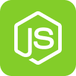

<p align='center' >
  
</p>

---

<p align='center' >
  
  
  
</p>

<p align='center'> 
  
</p>

<p align='center' >
 Back-end da aplicação New Game +, feito utilizando Express nos padrões REST API.
</p>

---

## ⚡ Bibliotecas utilizadas

- [Bcrypt](https://www.npmjs.com/package/bcryptjs) - Criptografia de senhas.
- [CORS](https://www.npmjs.com/package/cors) - Lib que configura o CORS na aplicação.
- [Dotenv](https://www.npmjs.com/package/dotenv) - Facilita a criação e uso de variáveis de ambiente.
- [Express](https://www.npmjs.com/package/express) - Framework minimalista que lida com a web.
- [JsonWebToken](https://www.npmjs.com/package/jsonwebtoken) - Implementação do JWT, oferecendo criação e _decode_ de tokens.
- [Multer](https://www.npmjs.com/package/multer) - Tratamento das imagens enviadas.
- [MySQL2](https://www.npmjs.com/package/mysql2) - Driver do MySQL.
- [Sequelize](https://www.npmjs.com/package/sequelize) - ORM que facilita trabalhar com banco de dados.
- [Yup](https://www.npmjs.com/package/yup) - Validação de campos.

---

## ➡️ Documentação das rotas

`POST auth/sign-up` - responsável pelo cadastro de novos usuários.
`POST auth/sign-in` - rota de login do usuário, com validação e autenticação.
`GET auth/get-user-info` - retorna informações sobre o usuário logado.
&nbsp;&nbsp;&nbsp;&nbsp;
`POST game/create` - registro de um novo anúncio de um jogo.
`PUT game/update/:id` - atualização do anúncio informado por meio do seu id.
`DELETE game/delete/:id` - exclusão do anúncio informado por meio do seu id.
`GET game/list-all` - lista todos os jogos anunciados de acordo com os seguintes _query params_:

- title - Título do jogo
- uf - Estado
- city - Cidade

`GET game/show/:id` - lista as informações de um anúncio especificado pelo seu id.
`GET game/list-mine` - lista todos os anúncios feitos pelo própio usuário.
`GET game/show-mine/:id` - lista as informações de um anúncio do usuário especificado pelo seu id.

## 🔨 Instalação

Primeiramente, certifique-se de instalar o [yarn](https://yarnpkg.com/) na sua máquina. Além disso, instale o [MySQL](https://dev.mysql.com/downloads/) caso não for usar outro banco.

Clone o repositório e vá para a pasta _server_

```shell
git clone https://github.com/vitorpedeo/new-game-plus.git
```

```shell
cd server
```

Instale todas as dependências

```shell
yarn install
```

Inicie o servidor

```shell
yarn dev
```
